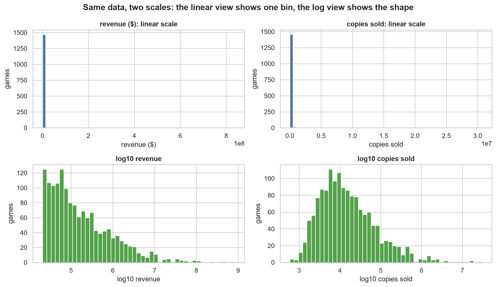
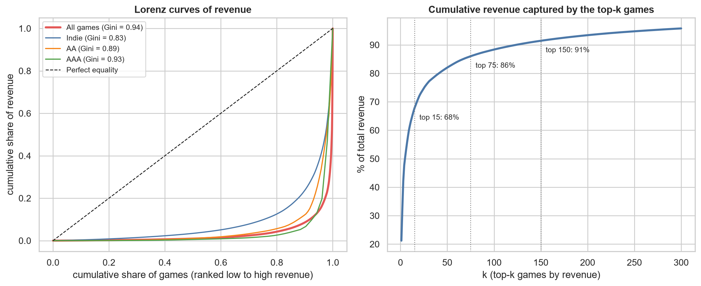
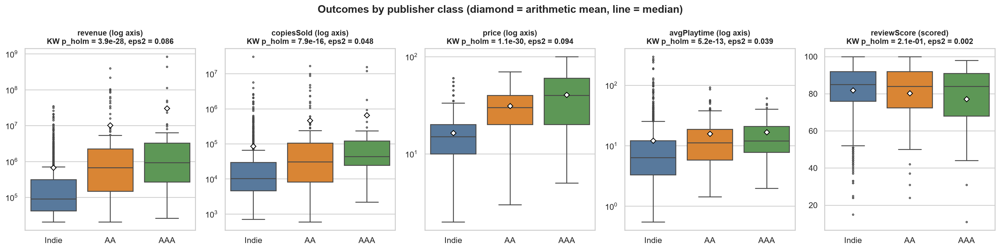
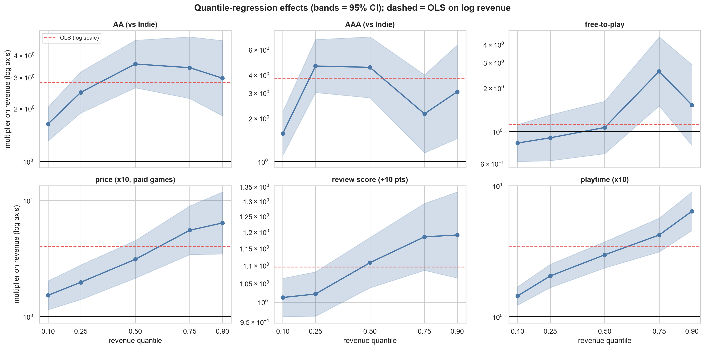
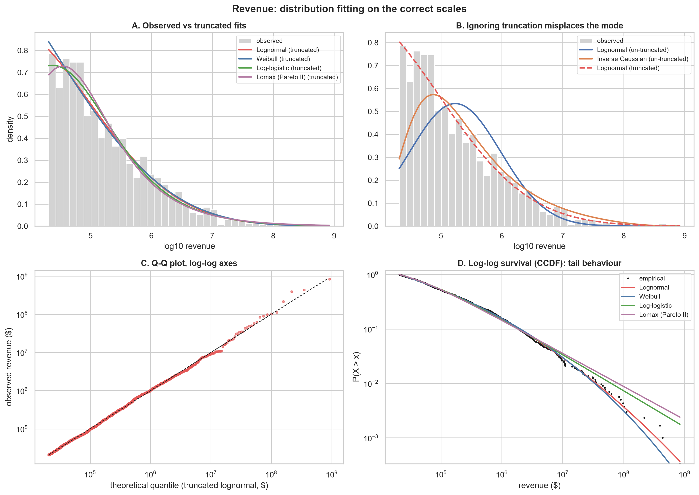
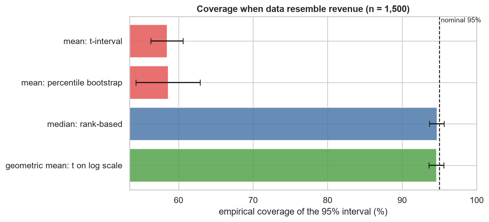

# Final Report: What Drives Commercial Success Among Top-Earning Steam Games?

**Course:** CSX2003 (First-Year Statistics), Assumption University
**Team:** statistics-standards
**Date:** September 20, 2026
**Dataset:** Top 1,500 Steam games by revenue, released 1 Jan – 9 Sep 2024 (Kaggle snapshot dated 09-09-2024)
**Repository:** `natetat-svg/statistics-standards`

---

## 1. Problem Statement

The Steam storefront is a hit-driven market: thousands of games are released, but a small number earn most of the money. This project asks how observable characteristics of a game relate to its commercial performance. Specifically:

1. **Concentration.** How unevenly is revenue distributed across games?
2. **Publisher class.** Do Indie, AA and AAA publishers differ in revenue, sales volume, price, playtime and review scores, and how large are the differences?
3. **Reviews.** Is review sentiment associated with publisher class, and with revenue?
4. **Drivers of revenue.** Which of publisher class, price, playtime and review score is most strongly associated with revenue once the others are held fixed?
5. **Distribution.** Can revenue be described by a standard probability distribution?
6. **Uncertainty.** Which summary of "typical revenue" can be estimated with trustworthy confidence intervals?

**Data.** 1,500 games × 12 variables (11 original plus derived `revenue_per_copy`): `name`, `releaseDate`, `copiesSold`, `price`, `revenue`, `avgPlaytime`, `reviewScore`, `publisherClass` (Indie 86.8%, AA 9.7%, AAA 3.5%), `publishers`, `developers`, `steamId`. Missingness was under 0.1% (three text fields, filled with the mode); no duplicates.

---

## 2. Methodology

The project ran in three stages. The third stage exists because the first two used methods that did not suit this data.

### 2.1 Stage 1: Acquisition, cleaning and exploration (Week 1)
Cleaning, descriptive statistics, Shapiro–Wilk normality tests, Pearson/Spearman correlation and exploratory plots (`notebooks/00`–`03`). Every numeric variable failed the normality test. Revenue skewness was 22.9, and the mean revenue ($2.63M) was 24× the median ($109K).

### 2.2 Stage 2: Classical inference (Week 2)
Welch t-tests, one-way ANOVA, a chi-square test, KS goodness-of-fit for candidate distributions, and t/percentile-bootstrap confidence intervals for the mean.

### 2.3 Stage 3: Robust re-analysis (Week 3, basis for all results below)
An audit of the data found four properties that the Stage 2 methods did not handle:

| Property | Evidence | Why it matters |
|---|---|---|
| Extreme concentration | Gini = 0.935; top 15 games (1%) earn 67.8% of revenue | Means, Pearson r, t-tests and ANOVA are driven by a handful of games |
| Left-truncation | Sample is the top 1,500, so revenue never falls below $20,674 | Untruncated distribution fits are misspecified |
| Disguised missing values | 99 games have `reviewScore == 0`; their median revenue is $268K vs $101K for scored games (Mann–Whitney p = 4×10⁻⁸) | Zeros are "unscored", not a real review tier |
| Mixed business models | 85 free-to-play games (`price == 0`) | Price summaries mix two populations |

The methods were replaced as follows:

| Task | Stage 2 method | Final method |
|---|---|---|
| Description | mean, SD | median, IQR, MAD, geometric mean, trimmed mean, Lorenz curve/Gini, top-*k* share |
| Group comparison | Welch t, ANOVA | Kruskal–Wallis (ε²), Dunn–Holm post-hoc, Cliff's δ and median ratios with bootstrap CIs; Welch ANOVA + Games–Howell on log₁₀ as a cross-check |
| Correlation | Pearson | Spearman with Holm adjustment; partial and within-class Spearman |
| Categorical association | one chi-square, one binning | chi-square on scored games, Cramér's V, permutation p-values, cut-point sensitivity |
| Distribution fitting | KS with estimated parameters | truncated MLE, AIC/BIC, parametric-bootstrap KS, log-scale Q-Q and CCDF, tail analysis |
| Intervals | t / percentile bootstrap for the mean | BCa bootstrap for median, trimmed mean and geometric mean, with a coverage simulation |
| Explanatory modelling | none | OLS on log₁₀ revenue (HC3 errors), quantile regression, Gamma GLM |
| Multiple testing | none | Holm correction across a defined family of 7 tests |

Implementation: Python (pandas, numpy, scipy, statsmodels, scikit-learn, matplotlib, seaborn), notebooks `00`–`06`, helper module `src/statistics.py`. Notebooks must run in order.

---

## 3. Results

### 3.1 Why linear-scale analysis fails here



*Figure 1. On a linear axis nearly all games fall into one bin. On a log₁₀ axis the shape of revenue and copies sold becomes visible. All later figures use log axes for these variables.*

### 3.2 Revenue is extremely concentrated



*Figure 2. Left: Lorenz curves of revenue overall and by publisher class. Right: cumulative revenue share captured by the top-k games.*

| Measure | Value |
|---|---|
| Gini coefficient (revenue) | 0.935 |
| Top 1 / 10 / 15 games | 21.2% / 61.6% / 67.8% of all revenue |
| Top 5% / 10% / 20% of games | 86.0% / 91.4% / 95.8% |
| Median revenue (95% BCa CI) | $109,053 ($98,850 – $120,300) |
| Geometric mean revenue (95% BCa CI) | $171,715 ($158,200 – $187,200) |
| Arithmetic mean revenue | $2,632,382 (24× the median) |

| Publisher class | % of games | % of revenue | Median revenue (95% BCa CI) | Gini |
|---|---|---|---|---|
| Indie | 86.8 | 22.2 | $90,770 ($80,320 – $103,000) | 0.826 |
| AA | 9.7 | 37.6 | $672,187 ($428,800 – $916,900) | 0.894 |
| AAA | 3.5 | 40.2 | $928,862 ($583,200 – $1,335,000) | 0.928 |

AA and AAA together are 13% of games but 78% of revenue. Inequality is high even within each class.

### 3.3 Publisher class separates revenue, sales, price and playtime, but not review scores



*Figure 3. Distribution of five outcomes by publisher class (log axes except review score). Diamond = mean, line = median. Panel titles give the Holm-adjusted Kruskal–Wallis p-value and ε².*

Kruskal–Wallis across Indie / AA / AAA (Holm-adjusted across the five outcomes):

| Outcome | H | ε² | p (Holm) |
|---|---|---|---|
| revenue | 129.0 | 0.086 | 3.9×10⁻²⁸ |
| copiesSold | 71.8 | 0.048 | 7.9×10⁻¹⁶ |
| price | 141.2 | 0.094 | 1.1×10⁻³⁰ |
| avgPlaytime | 57.9 | 0.039 | 5.2×10⁻¹³ |
| reviewScore (scored games) | 3.1 | 0.002 | 0.21 |

Revenue, pairwise:

| Contrast | Median ratio (95% CI) | Cliff's δ (95% CI) | Dunn p (Holm) |
|---|---|---|---|
| AA vs Indie | 7.4× (4.7 – 9.9) | 0.48 [0.40, 0.56] (large) | 3×10⁻²¹ |
| AAA vs Indie | 10.2× (5.7 – 14.7) | 0.54 [0.39, 0.68] (large) | 4×10⁻¹¹ |
| AAA vs AA | 1.4× (0.8 – 2.4) | 0.09 [−0.10, 0.26] (negligible) | 0.49 |

Games–Howell on log₁₀ revenue agrees: AAA/Indie geometric-mean ratio ≈ 7.9×, AA/Indie ≈ 5.4×, AAA vs AA p = 0.59.

**A Stage 2 result was reversed.** Week 2 reported no significant AAA vs Indie revenue difference (Welch p = 0.104). That was an artefact of comparing means dominated by a few blockbusters. Every tail-robust method finds a large difference (Mann–Whitney p = 3×10⁻¹¹). AA and AAA are not distinguishable from each other.

**Review tier vs publisher class (chi-square).** The Week 2 result (χ² = 6.65, p = 0.155) was reproduced exactly, which confirmed that unscored games had been counted as a review tier.

| Scheme | n | χ² (df = 4) | p (asymptotic / permutation) | Cramér's V |
|---|---|---|---|---|
| Week 2 replica (zeros as lowest tier; cuts 70/90) | 1,500 | 6.65 | 0.155 / 0.153 | 0.030 |
| Scored only; cuts 70/90 | 1,401 | 8.30 | 0.081 / 0.082 | 0.039 |
| Scored only; cuts 60/85 | 1,401 | 4.58 | 0.333 / 0.322 | 0.014 |
| Scored only; cuts 75/90 | 1,401 | 8.28 | 0.082 / 0.080 | 0.039 |
| Scored only; terciles | 1,401 | 3.38 | 0.497 / 0.494 | 0.000 |

No association is detected, but the conclusion is weaker than first reported, depends on the cut-points, and the effect size is negligible (V ≤ 0.04). Across the Holm family of 7 tests, only the four Kruskal–Wallis tests on revenue, copies sold, price and playtime are significant.

### 3.4 What is associated with revenue?

**Correlations (Spearman, Holm-adjusted):**

| Pair | ρ | p (Holm) |
|---|---|---|
| revenue – copiesSold | 0.869 | < 10⁻¹⁰ |
| revenue – avgPlaytime | 0.438 | 2×10⁻⁷⁰ |
| revenue – price | 0.312 | 3×10⁻³⁴ |
| revenue – reviewScore | 0.037 | 0.48 |

The partial Spearman correlation of review score with revenue, controlling for price and playtime, is 0.039 (p = 0.14).

**Regression.** OLS on log₁₀ revenue with HC3 robust errors (n = 1,400, R² = 0.312). Coefficients are multipliers on geometric-mean revenue:

| Term | Multiplier (95% CI) | p | Drop-one ΔR² |
|---|---|---|---|
| AA vs Indie | 2.8× (2.0 – 3.9) | 1×10⁻⁹ | 0.043 (class block) |
| AAA vs Indie | 3.8× (2.2 – 6.5) | 1×10⁻⁶ | |
| Price ×10 (paid games) | 4.0× (2.9 – 5.7) | 6×10⁻¹⁶ | 0.036 |
| Playtime ×10 | 3.4× (2.8 – 4.2) | 5×10⁻³⁰ | 0.073 |
| Review score +10 points | 1.10× (1.04 – 1.16) | 0.0013 | 0.005 |
| Free-to-play | 1.1× (0.7 – 1.8) | 0.64 | 0.0002 |

Playtime is the largest single block, followed by publisher class and price. Review score has a detectable but small association. Results are stable to dropping high-influence points, adding unscored games with an indicator, and adding release-month effects. All VIFs are below 1.4.



*Figure 4. Quantile-regression multipliers (solid, with 95% bands) against the single OLS multiplier (dashed red). Price, playtime and review score have larger effects higher in the revenue distribution.*

| Predictor | q = 0.10 | q = 0.50 | q = 0.90 |
|---|---|---|---|
| Price ×10 | 1.5× | 3.1× | 6.5× |
| Playtime ×10 | 1.4× | 3.0× | 6.3× |
| Review +10 pts | 1.01× | 1.11× | 1.19× |

A single OLS slope hides this fan shape. On the mean scale (Gamma GLM) the class effects are larger (AAA 13×, AA 5×) because they act mostly through hits.

### 3.5 Distribution of revenue



*Figure 5. (A) Truncated fits against observed log₁₀ revenue. (B) Ignoring truncation misplaces the mode. (C) Q-Q plot against the truncated lognormal. (D) Survival function on log-log axes.*

| Variable | Best family (AIC) | KS D | Bootstrap-KS p | Verdict |
|---|---|---|---|---|
| revenue (truncated at $20,674) | Lognormal (Weibull ΔAIC = 1.2) | 0.020 | 0.118 | Adequate |
| revenue (untruncated lognormal) | n/a | 0.109 | 0.002 | Rejected (misspecified) |
| copiesSold | Inverse Gaussian | 0.057 | 0.005 | No adequate 2-parameter family |
| avgPlaytime | Inverse Gaussian (lognormal ΔAIC = 3.1) | 0.036 | 0.005 | No adequate 2-parameter family |
| reviewScore (scored) | Beta (Normal ΔAIC = 520) | 0.043 | n/a | Beta far better than Normal |

**A second Stage 2 result was corrected.** "No variable fits a standard distribution" does not hold for revenue: once left-truncation is respected, a lognormal fits well.

For the tail (top 282 games, revenue ≥ $787K), the power-law exponent is α = 1.76 ± 0.05. A power law beats an exponential tail (p < 10⁻⁵) but cannot be distinguished from a lognormal (p = 0.62) or a truncated power law (p = 0.23). A "very heavy tail" is supported; "power law" specifically is not.

### 3.6 Confidence intervals: mean vs robust alternatives

| Revenue estimand | Estimate | 95% CI | Width / estimate |
|---|---|---|---|
| Mean, t-interval | $2.63M | $1.22M – $4.04M | 1.07 |
| Mean, BCa | $2.63M | $1.69M – $5.01M | 1.26 |
| 10% trimmed mean, BCa | $278.8K | $244.5K – $320.5K | 0.27 |
| Median, BCa | $109.1K | $98.9K – $120.3K | 0.20 |
| Geometric mean, BCa | $171.7K | $158.2K – $187.2K | 0.17 |



*Figure 6. Empirical coverage of nominal 95% intervals on synthetic data resembling revenue (n = 1,500, lognormal truth). Error bars are simulation uncertainty.*

| Procedure | Lognormal truth | Weibull truth |
|---|---|---|
| Mean, t-interval | 58.5% | 75.6% |
| Mean, percentile bootstrap | 58.6% | n/a |
| Median, rank-based | 94.7% | 93.8% |
| Geometric mean, t on log scale | 94.6% | n/a |

Neither interval for the mean reaches nominal coverage on revenue-like data, so the Week 2 recommendation to trust the bootstrap CI for the mean is not supported. Median and geometric-mean intervals do achieve nominal coverage.

---

## 4. Conclusions

**Main findings**

1. **Revenue is a winner-take-most outcome.** The Gini coefficient is 0.935, and 15 games out of 1,500 earn 68% of all revenue. The mean is 24× the median and should not be used to describe a typical game.
2. **Publisher class matters, and the gap is between Indie and everything else.** AA and AAA games earn about 7× and 10× the median Indie revenue (large effects, δ ≈ 0.5). AA and AAA are statistically indistinguishable. Classes also differ in copies sold, price and playtime, but not in review scores.
3. **Review scores are close to irrelevant for revenue.** Marginal ρ = 0.037; after adjustment, +10 points is associated with about +10% revenue, and the association is strongest in the upper tail.
4. **Playtime, price and publisher class are the main correlates of revenue.** Together with review score they explain about 31% of the variance in log revenue. Effects of price and playtime grow from about 1.5× at the 10th percentile to about 6× at the 90th.
5. **Revenue is well described by a truncated lognormal.** The tail is very heavy but cannot be confirmed as a power law.
6. **Use the median or geometric mean, not the mean.** Their intervals have correct coverage and are roughly 4–7× narrower relative to the estimate.

**Methodological lesson.** Applying t-tests, ANOVA and mean-based intervals to skewed, truncated data produced a wrong conclusion (AAA vs Indie "not significant"), an overstated conclusion (independence of review tier and publisher), and an untrustworthy interval. Stage 3 reversed or corrected each of these, and the test family is now Holm-adjusted.

**Limitations**

- **Selection on the outcome.** Only the top 1,500 games by revenue are included. Conclusions concern already-successful games, associations are attenuated relative to the full catalogue, and drivers of *becoming* successful cannot be identified.
- **Association, not causation.** The positive price coefficient reflects that larger-budget titles charge more, not that raising a price raises revenue. Playtime may be an outcome of quality and content volume as much as a driver.
- **Unscored games are not missing at random** (higher median revenue). Review-based analyses use the 1,401 scored games; a sensitivity model with an indicator gives the same coefficients.
- **Revenue is not price × copies** (median ratio 0.81), so `copiesSold` and `revenue_per_copy` are treated as outcomes, not predictors.
- **Conclusions about the mean of revenue** depend on tail behaviour beyond the observed range.
- **Genre, release timing and developer effects** are not yet modelled.

**Possible extensions:** add genre and developer information; model release timing; compare against a sample that includes low-revenue games to quantify selection bias.

---

## 5. Team Contributions

| Team member | Role | Contributions |
|---|---|---|
| **Natetat Tubdoung** | Project Lead & Data Curator | Data preparation and cleaning, environment and repository management, project structure and report integration; coordinated the Week 3 robust re-analysis. |
| **Theerawat Rungroung** | Statistical Analyst | Statistical analysis: hypothesis tests, distribution fitting, confidence intervals, and the `StatisticalAnalyzer` class. |
| **Theerathat Rakkiat** | Visualization Specialist | Exploratory and analytical visualizations, and visualization support across the project. |

Hours recorded in the Week 2 report (Week 2 only; hours for Weeks 1 and 3 were not logged):

| Team member | Week 2 tasks | Week 2 hours |
|---|---|---|
| Natetat | Data prep, environment management, repo structure | 2 |
| Theerawat | All statistical tests and analysis | 8 |
| Theerathat | Visualization support | 3 |

---

## Appendix: Reproducing the Analysis

```bash
pip install -r requirements.txt
cd notebooks
jupyter nbconvert --to notebook --execute --inplace 00_initial_inspection.ipynb
jupyter nbconvert --to notebook --execute --inplace 01_data_cleaning.ipynb
jupyter nbconvert --to notebook --execute --inplace 02_statistical_summary.ipynb
jupyter nbconvert --to notebook --execute --inplace 03_exploratory_visualizations.ipynb
jupyter nbconvert --to notebook --execute --inplace 04_hypothesis_testing.ipynb
jupyter nbconvert --to notebook --execute --inplace 05_distribution_fitting.ipynb
jupyter nbconvert --to notebook --execute --inplace 06_confidence_intervals.ipynb
```

Notebooks `01`–`06` must run in order: `01` produces `cleaned_data.csv` and `robust_data.csv`, which later notebooks load via `statistics.load_robust()`.

**Key outputs:** `src/statistics.py`; `reports/week1_report.md`, `week2_report.md`, `week3_report.md`; `reports/robust_*.csv`, `regression_*.csv`, `ci_*.csv`, `distribution_fits_robust.csv`, `hypothesis_tests_robust.csv`; `reports/figures/`.
