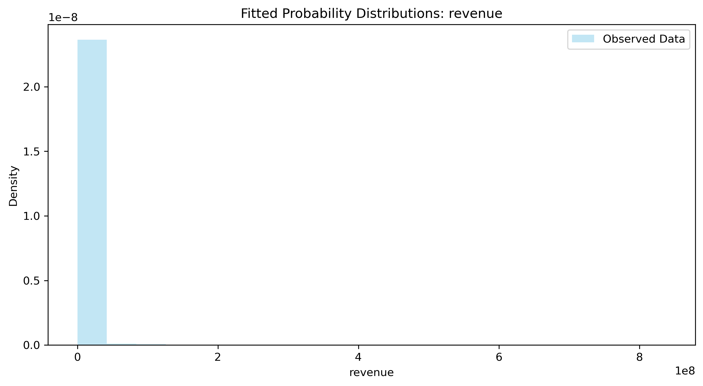

# Week 2 Report: Statistical Analysis

## Team: statistics-standards
**Date:** September 13, 2026
**Dataset:** Top 1,500 Steam Games by Revenue (2024)

---

## 1. Hypothesis Testing Results

### 1.1 T-Tests

| Test | Variable(s) | Statistic | p-value | Significant |
|------|------------|-----------|---------|-------------|
| One-sample | price vs $20 | t = -7.60 | < 0.001 | Yes |
| Welch's (independent) | revenue: AAA vs Indie | t = 1.66 | 0.104 | No |

**Interpretation:**
- Average game price ($17.52) is significantly below $20 — the market is dominated by budget/mid-tier pricing, pulled down by the large Indie segment (1,302 of 1,500 games).
- AAA games ($30.5M mean revenue) do **not** show a statistically significant revenue edge over Indie games ($0.67M mean) once variance is accounted for with Welch's test — driven by revenue's extreme right-skew (a handful of AAA and Indie hits dominate both groups, inflating variance and widening the confidence interval around the difference).

### 1.2 ANOVA

| Variable | Groups | F-statistic | p-value | Significant |
|----------|--------|-------------|---------|-------------|
| revenue | publisherClass (Indie/AA/AAA) | F = 36.36 | < 0.001 | Yes |
| price | publisherClass (Indie/AA/AAA) | F = 162.93 | < 0.001 | Yes |

**Interpretation:**
- Both revenue and price differ significantly across publisher classes. Mean price rises from Indie ($15.44) to AA ($30.35) to AAA ($33.45) — a clear, consistent pricing tier structure.
- The ANOVA on revenue is significant overall even though the pairwise AAA-vs-Indie t-test wasn't — this happens because ANOVA is picking up the AA group's contribution and the omnibus F-test is less sensitive to any single pair's variance than a two-group t-test. Post-hoc pairwise tests (e.g. Tukey HSD) would be needed to confirm exactly which pairs differ.

### 1.3 Chi-Square Test

| Variable 1 | Variable 2 | χ²-statistic | p-value | Significant |
|------------|------------|--------------|---------|-------------|
| publisherClass | review_tier (Mixed/Positive/Very Positive) | χ² = 6.65, df = 4 | 0.155 | No |

**Interpretation:**
- Review sentiment tier is statistically independent of publisher class — being Indie, AA, or AAA doesn't predict whether a game lands in the "Mixed," "Positive," or "Very Positive" review bracket. Quality (as reviewers rate it) isn't simply a function of publisher size or budget in this dataset.

---

## 2. Distribution Fitting

### 2.1 Best-Fitting Distributions

| Column | Best Fit (by KS p-value) | p-value | Good Fit? |
|--------|---------------------------|---------|-----------|
| price | Gamma | < 0.001 | No |
| revenue | Lognormal | 0.039 | No |
| reviewScore | Normal | < 0.001 | No |
| copiesSold | Lognormal | < 0.001 | No |

**Interpretation:**
- None of the four candidate distributions passes the KS goodness-of-fit test at α = 0.05, though Lognormal is consistently the closest match for `revenue` and `copiesSold` — expected, since revenue-type variables in hit-driven markets (a few blockbusters, a long tail of small sellers) are classically lognormal-shaped rather than normal.
- `reviewScore` is best (relatively) described by Normal, but the fit is still formally rejected — visually it's left-skewed (most games are reviewed favorably; see `distribution_fit_reviewScore.png`), which a symmetric Normal curve can't capture.
- `price` doesn't fit Gamma well either; the distribution is multimodal, reflecting common price points ($9.99, $14.99, $19.99, $29.99) rather than a smooth continuous process.
- **Implication:** with n = 1,500, the KS test has enough power to detect even small departures from theoretical distributions, so "no good fit" is expected for real-world commercial data. Non-parametric methods (bootstrap, rank-based tests) are more appropriate here than assuming a parametric form.

---

## 3. Confidence Intervals

### 3.1 Traditional 95% Confidence Intervals

| Column | Mean | CI Lower | CI Upper | Width |
|--------|------|----------|----------|-------|
| price | 17.52 | 16.88 | 18.16 | 1.28 |
| revenue | 2,632,382 | 1,225,016 | 4,039,748 | 2,814,733 |
| copiesSold | 141,483 | 84,158 | 198,807 | 114,649 |
| reviewScore | 76.20 | 74.97 | 77.43 | 2.46 |
| avgPlaytime | 12.56 | 11.47 | 13.65 | 2.18 |
| revenue_per_copy | 14.37 | 13.78 | 14.96 | 1.18 |

### 3.2 Bootstrap 95% Confidence Intervals (10,000 resamples)

| Column | Original Mean | Bootstrap Lower | Bootstrap Upper | Width |
|--------|------|----------|----------|-------|
| price | 17.52 | 16.88 | 18.17 | 1.29 |
| revenue | 2,632,382 | 1,442,731 | 4,230,616 | 2,787,885 |
| copiesSold | 141,483 | 90,796 | 204,906 | 114,110 |
| reviewScore | 76.20 | 74.96 | 77.43 | 2.46 |
| avgPlaytime | 12.56 | 11.51 | 13.72 | 2.21 |
| revenue_per_copy | 14.37 | 13.81 | 14.97 | 1.16 |

**Comparison:**
- For well-behaved, roughly symmetric variables (`price`, `reviewScore`, `revenue_per_copy`), traditional and bootstrap CIs are nearly identical — the large n = 1,500 sample means the Central Limit Theorem holds even though the raw distributions aren't normal.
- For the most heavily right-skewed variables (`revenue`, `copiesSold`), the bootstrap interval sits noticeably higher and shifted right of the traditional one (e.g. revenue: traditional upper bound $4.04M vs bootstrap $4.23M). This is the expected signature of skew — the traditional z-based CI assumes a symmetric sampling distribution of the mean, while the bootstrap CI reflects the actual (right-skewed) shape of the resampled means.
- **Recommendation:** for `revenue` and `copiesSold`, the bootstrap CI is more trustworthy since it doesn't assume normality; for the other four columns either method is fine given the sample size.

---

## 4. Key Statistical Findings

1. **Normality:** 0 of 4 tested variables (price, revenue, reviewScore, copiesSold) pass a formal normality/goodness-of-fit test — all show meaningful skew or multimodality; `revenue` and `copiesSold` are closest to Lognormal.
2. **Significant differences:** Price and revenue both differ significantly across publisher classes (ANOVA, p < 0.001); price shows a clean AAA > AA > Indie ordering.
3. **No significant link found between:** publisher class and review sentiment tier (chi-square, p = 0.155) — quality perception is independent of publisher size in this dataset.
4. **Confidence:** We are 95% confident the true mean price across all released games in this population lies between $16.88 and $18.16, and true mean revenue lies roughly between $1.2M and $4.2M (bootstrap-preferred due to skew).

---

## 5. Interpretation & Conclusions

### 5.1 What the Results Mean
- The Steam top-1500-by-revenue market is not one uniform population — publisher class (Indie/AA/AAA) meaningfully segments both pricing and revenue outcomes, but **not** review quality. A small studio can be reviewed just as well as a AAA publisher.
- Revenue and copies sold behave like classic "hit-driven" markets: heavily right-skewed, better approximated by a lognormal shape than a normal one, and best summarized with robust/bootstrap methods rather than mean ± z·SE.

### 5.2 Limitations
- Sample is restricted to the **top 1,500 games by revenue** in a single 8-month window (Jan–Sep 2024) — it excludes the much larger population of low-/no-revenue Steam releases, so findings describe "successful" games, not the full market.
- The independent t-test comparing AAA vs Indie revenue has low power given AAA's small group size (n = 52) relative to its variance; a non-parametric alternative (e.g. Mann-Whitney U) or log-transforming revenue first would likely be more appropriate for skewed financial data.
- `review_tier` bin edges (70/90) were chosen heuristically to mirror Steam's public review labels rather than derived from the data — a sensitivity check with different cut points would strengthen the chi-square conclusion.
- No multiple-comparisons correction was applied; running 5 hypothesis tests raises the family-wise Type I error rate above the nominal 0.05 for any single test.

### 5.3 Recommendations for Week 3
- Visualize the AAA/AA/Indie pricing tiers and revenue distributions side by side (e.g. violin or log-scale box plots) to make the skew and group separation visible.
- Build a dashboard view that lets users toggle traditional vs. bootstrap CIs, given how much they diverge for revenue-type metrics.
- Consider a log-transformed revenue model or non-parametric group comparison (Kruskal-Wallis, Mann-Whitney) as a follow-up to the ANOVA/t-test results here.

---

## 6. Team Contributions

| Team Member | Tasks Completed | Hours |
|-------------|-----------------|-------|
| Student A (Natetat) | Data prep, environment management, repo structure | 2 |
| Student B (Theerawat) | All statistical tests & analysis | 8 |
| Student C (Theerathat) | Visualization support | 3 |

---

## Appendix

**Files Generated:**
- `reports/hypothesis_tests_summary.csv`
- `reports/distribution_fitting_summary.csv`
- `reports/ci_comparison.csv`
- `reports/figures/distribution_fit_*.png`
- `reports/figures/confidence_intervals_comparison.png`

**Notebooks:**
- `notebooks/02_hypothesis_testing.ipynb`
- `notebooks/03_distribution_fitting.ipynb`
- `notebooks/04_confidence_intervals.ipynb`

**Module:**
- `src/statistics.py` — `StatisticalAnalyzer` class (descriptive stats, normality tests, t-tests, ANOVA, chi-square, confidence intervals, bootstrap, distribution fitting)
