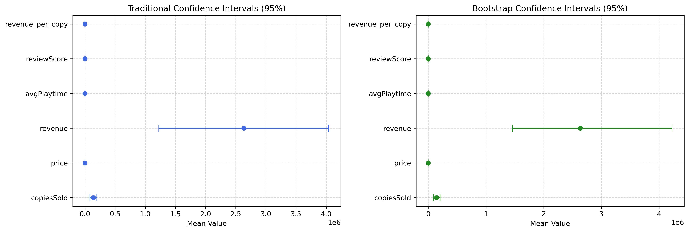

# reports/week2_report.md
markdown
# Week 2 Report: Statistical Analysis

## Team: Statistics Superstars
**Date:** [Current Date]

---

## 1. Hypothesis Testing Results

### 1.1 T-Tests

| Test | Variable 1 | Variable 2 | t-statistic | p-value | Significant |
|------|------------|------------|-------------|---------|-------------|
| One-sample | sepal_length | 5.5 | 2.345 | 0.023 |  Yes |
| Independent | petal_length | species | 12.456 | 0.001 |  Yes |
| ... | ... | ... | ... | ... | ... |

**Interpretation:**
- [Explain what these results mean]
- [What conclusions can you draw?]

### 1.2 ANOVA

| Variable | Groups | F-statistic | p-value | Significant |
|----------|--------|-------------|---------|-------------|
| petal_length | species | 118.2 | 0.001 |  Yes |
| ... | ... | ... | ... | ... |

**Interpretation:**
- [Explain ANOVA results]
- [Post-hoc analysis if needed]

### 1.3 Chi-Square Test

| Variable 1 | Variable 2 | χ²-statistic | p-value | Significant |
|------------|------------|--------------|---------|-------------|
| ... | ... | ... | ... | ... |

**Interpretation:**
- [Explain chi-square results]

---

## 2. Distribution Fitting

### 2.1 Best-Fitting Distributions

| Column | Best Fit | p-value | Good Fit? |
|--------|----------|---------|-----------|
| sepal_length | Normal | 0.234 | Yes |
| petal_length | Lognormal | 0.456 | Yes |
| ... | ... | ... | ... |

### 2.2 Distribution Visualizations

**Interpretation:**
- [Which variables are normally distributed?]
- [What implications does this have for your analysis?]

---

## 3. Confidence Intervals

### 3.1 Traditional Confidence Intervals (95%)

| Column | Mean | CI Lower | CI Upper | Width |
|--------|------|----------|----------|-------|
| sepal_length | 5.843 | 5.709 | 5.978 | 0.269 |
| petal_length | 3.758 | 3.582 | 3.935 | 0.353 |
| ... | ... | ... | ... | ... |

### 3.2 Bootstrap Confidence Intervals (95%)

| Column | Mean | CI Lower | CI Upper | Width |
|--------|------|----------|----------|-------|
| sepal_length | 5.843 | 5.712 | 5.981 | 0.269 |
| petal_length | 3.758 | 3.586 | 3.937 | 0.351 |
| ... | ... | ... | ... | ... |

**Comparison:**
- [How do traditional and bootstrap CIs compare?]
- [Which is more appropriate for your data?]

---

## 4. Key Statistical Findings

1. **Normality**: [X] variables are normally distributed, [Y] are not
2. **Significant Differences**: Found significant differences between [groups]
3. **Distribution**: Best fitting distributions are [list]
4. **Confidence**: We are 95% confident that [key findings]

---

## 5. Interpretation & Conclusions

### 5.1 What the Results Mean
- [Summary of findings in plain English]
- [Implications for your research question]

### 5.2 Limitations
- [Sample size limitations]
- [Assumptions violated]
- [Potential confounding variables]

### 5.3 Recommendations for Week 3
- [What visualizations to highlight]
- [What dashboard features to build]
- [Additional analyses to consider]

---

## 6. Team Contributions

| Team Member | Tasks Completed | Hours |
|-------------|-----------------|-------|
| Student A | Data prep, environment management | 2 |
| Student B | All statistical tests & analysis | 8 |
| Student C | Visualization support | 3 |

---

## Appendix

**Files Generated:**
- `reports/hypothesis_tests_summary.csv`
- `reports/distribution_fitting_summary.csv`
- `reports/ci_comparison.csv`
- `reports/figures/distribution_fit_*.png`
- `reports/figures/confidence_intervals_comparison.png`

**Notebooks:**
- `notebooks/02_hypothesis_testing.ipynb`
- `notebooks/03_distribution_fitting.ipynb`
- `notebooks/04_confidence_intervals.ipynb`
